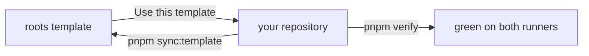

# roots

A GitHub template for pnpm + Turborepo TypeScript monorepos that AI coding
agents can work in safely from day one.

Tooling enforces the rules: one agent rulebook read by Claude Code, Codex, and
Gemini CLI; guards that stop the common agent mistakes before they run; a done
gate that is the same locally and in CI; a docs system with decisions, specs,
and portable markdown; and a sync that keeps the shared mechanics current after
you have made the template your own.

## Who it is for, and not for

Solo developers and small teams starting a TypeScript monorepo where Claude
Code, Codex, or Gemini CLI do a large share of the work, on Linux, macOS, or
Windows.

Not for stacks other than TypeScript on node (the docs tooling needs node 24
and pnpm either way), teams that want an external spec framework such as
Spec-Kit (the built-in decisions-and-specs flow is deliberately small),
publishing npm libraries out of the box (a recipe exists, nothing is wired), or
anyone who wants an unopinionated starter. The rules are the product.

## What is in the box

The agent layer is `AGENTS.md` as the single rulebook (`CLAUDE.md` imports it,
Codex reads it natively, Gemini CLI is pointed at it), pre-tool guards
registered in all three tools, and skills for the recurring procedures: first
run, new package, new spec, new decision, PR, template sync, release, docs
check.

The done gate is `pnpm verify`. It runs every CI check in CI order and stops at
the first failure; CI runs the same on Ubuntu and Windows.

The docs system holds decisions (why) and specs (what) with generated indexes
that cannot drift, in portable markdown that renders in GitHub, VitePress, and
Obsidian. It builds an internal handbook site and a public site; a shipped
workflow publishes the public one to GitHub Pages with `llms.txt` and a sitemap
for AI crawlers.

Template sync, `pnpm sync:template`, pulls the shared mechanics into any child
(copy, fork, or clone) and reports what a file copy cannot carry.

Dependency build scripts are off by default and dependency releases get a
48-hour cooldown; actions are pinned, and secrets are scanned at commit and in
CI.

A devcontainer with node 24, pnpm, and Claude Code is the sandbox for
unattended runs and Codespaces.

## Sixty-second tour

```text
AGENTS.md          the rulebook; CLAUDE.md is one line importing it
.claude/           guards (hooks/), rules, skills, writing rules (output-styles/), settings
.codex/ .gemini/   the same guards and writing rules registered for Codex and Gemini CLI
.agents/skills/    generated mirror of .claude/skills for Codex and Gemini
apps/ packages/    the workspace; example-app consumes example-package
docs/internal/     the handbook: decisions/ and specs/ (yours)
docs/public/       the public site (yours)
docs/template/     template-owned rules and contracts (synced; read on GitHub)
scripts/           verify, sync, the docs generators and checkers, test suites
.github/           CI on Ubuntu and Windows, docs gates, labels, templates
```



## First run

> [!IMPORTANT]
> You are reading a repository just created from the roots template. Nothing in
> the tree depends on the template's name, so there is no rename script. Work
> through this list once, then delete the section. In Claude Code the
> `first-run` skill does every step marked **(skill)** and hands you the rest.

1. **Prove the gates.** `pnpm install && pnpm verify`, green before you touch
   anything. **(skill)**
2. **Name it.** **(skill; it asks you for the one-line pitch)**
   - `package.json`: `name` (your repo slug) and `description`.
   - This file: the H1 and the pitch paragraph above. Keep the provenance line
     under "Where things live".
   - `LICENSE`: the copyright holder and year (the template ships MIT).
   - `.github/CODEOWNERS`: `@OWNER` becomes your GitHub user or team.
   - `.github/ISSUE_TEMPLATE/config.yml`: `OWNER/REPO` in both links.
   - `CODE_OF_CONDUCT.md`: the `[INSERT CONTACT METHOD]` placeholder.
   - Optional: a package scope other than `@repo/`. In any POSIX shell (Git
     Bash on Windows), `grep -rl '@repo/' --exclude-dir=node_modules .` lists
     every file.
3. **Agent tools.** The first time you open the folder, Codex and Gemini CLI ask
   you to trust it (Codex also trusts each hook once via `/hooks`); say yes or
   the guards stay off. If `main` is not your only protected branch, set
   `PROTECTED_BRANCHES` in the `env` block of `.claude/settings.json`
   (comma-separated globs). **(skill; the branch list only)**
4. **Samples and stubs.** `packages/example-package` and `apps/example-app`
   keep the gates honest; replace them when real code lands (the `new-package`
   skill scaffolds the house shape). Same for the pages under `docs/public/`.
   Not today.
5. **GitHub settings.** Needs `gh auth login`; `OWNER/REPO` is your repository.
   **(skill)**

   ```sh
   gh repo edit OWNER/REPO --description "your pitch" --add-topic typescript --enable-wiki=false --enable-projects=false
   gh workflow run labels.yml   # seeds the labels from .github/labels.yml
   ```

6. **Commit and push.** Delete this section, then
   `git commit -am "chore: initialize from roots"` and push `main`. This is the
   one direct push; everything after lands through a PR. **(skill proposes the
   commit; it never pushes)**
7. **Branch ruleset.** After `ci` and `docs` have reported on `main` at least
   once (a required check that never reports blocks every PR), run the ruleset
   command under "Push protection" in [guards](./docs/template/guards.md). Free
   on public repositories, GitHub Pro on private ones.
8. **Publish the public docs (optional).** Enable GitHub Pages with
   `gh api -X POST repos/OWNER/REPO/pages -f build_type=workflow`; the `pages`
   workflow deploys `docs/public/` on every push to `main` from then on. Then
   `gh repo edit OWNER/REPO --homepage https://OWNER.github.io/REPO/`.
   **(skill)**

## Setup

Node 24 (pinned in `.node-version`) and pnpm. On node 24, `corepack enable`
provides pnpm; on node 25 and later install it standalone (`npm i -g pnpm`).
Either way it honours the version pinned in `package.json`.

Linux, macOS, and Windows all work, and CI runs on Ubuntu and Windows. On
Windows use Git for Windows (Claude Code runs its shell through Git Bash), and
the devcontainer needs Docker Desktop. Then:

```sh
pnpm install
```

## Commands

| Command | What it does |
| --- | --- |
| `pnpm verify` | The done gate: every check CI runs, in CI order, stopping at the first failure (`pnpm verify <gate>` resumes there) |
| `pnpm build` / `pnpm test` / `pnpm typecheck` | Turbo across packages that define each script; `typecheck` also runs root `tsc` over scripts + configs |
| `pnpm --filter @repo/example-package test` | One package's tests (`test:watch` for watch mode) |
| `pnpm --filter @repo/example-app start` | Runs the sample CLI (`node src/main.ts`) against the sample package |
| `pnpm lint` / `pnpm lint:fix` | ESLint (antfu flat config) repo-wide |
| `pnpm lint:secrets` | secretlint over every tracked file (also runs on staged files at commit) |
| `pnpm test:hooks` | Agent guard fixtures (allow/deny cases, node only) |
| `pnpm test:sync` | Template-sync fixtures (throwaway template + child repos, node only) |
| `pnpm test:docs` | Docs checker fixtures (a clean tree and a broken one, node only) |
| `pnpm test:gates` | Drift check: `pnpm verify` and the workflows run the same steps |
| `pnpm docs:gen` | Regenerate the decisions and specs indexes and the `.agents/skills` mirror |
| `pnpm docs:check` / `pnpm docs:portability` | Docs structure + portability gates |
| `pnpm docs:internal:build` / `pnpm docs:public:build` | Site builds (CI-blocking) |
| `pnpm docs:internal:dev` | Internal handbook (VitePress, team-only) |
| `pnpm docs:public:dev` | Public docs site |
| `pnpm sync:template` | Pull the template's mechanics: stages them, records the sync point, prints commits since and `package.json` follow-ups (`--ref` pins a template tag or branch) |
| `pnpm release` | changelogen: version, CHANGELOG, tag, push; human-run (agents are blocked) |

## Working with AI agents

The rulebook is [AGENTS.md](./AGENTS.md). Claude Code reads it through the
one-line `CLAUDE.md`, Codex reads it natively, and Gemini CLI is pointed at it
by `.gemini/settings.json`. The first time you open the folder, Codex and
Gemini ask you to trust it (Codex also asks to trust each hook once via
`/hooks`); say yes, or the guards and project settings stay off.

A shared set of pre-tool guards denies the common mistakes in all three tools:
a non-pnpm package manager, enabling a dependency build script, reading a
secret file, pushing to a protected branch, and bypassing a git hook. The
threat model and scope are in [guards](./docs/template/guards.md).

One short rulebook for prose, `.claude/output-styles/writing.md`, loads at
every session start in all three tools: Claude Code's output style, a
SessionStart hook in Codex and Gemini.

Feature-branch pushes and PR creation run without prompts; `main` (or
`PROTECTED_BRANCHES`) is only reachable through a PR a human merges. The `pr`
skill does the whole thing the house way.

`pnpm sync:template` pulls the shared mechanics; the `sync-template` skill
drives it end to end. Recipe and contract are in
[docs/template/](./docs/template/README.md).

`.devcontainer/` gives every tool the same node 24 + pnpm environment inside a
container, for unattended runs and Codespaces. The egress firewall is an opt-in
recipe in [docs-toolchain](./docs/template/docs-toolchain.md).

## Where things live

- Agent rulebook: [AGENTS.md](./AGENTS.md), conventions and the
  canonical-source map.
- Code: `apps/` for deployables, `packages/` for libraries. The samples show the
  house shape; the `new-package` skill scaffolds more.
- Docs entry point: [docs/README.md](./docs/README.md), the two sites and the
  template-owned folder.
- Decisions (why): [docs/internal/decisions/](./docs/internal/decisions/index.md)
- Specs (what): [docs/internal/specs/](./docs/internal/specs/index.md)
- Template-owned rules and agent material (synced, never rendered):
  [docs/template/](./docs/template/README.md), including the
  [vocabulary](./docs/template/README.md#vocabulary) every page uses.
- Docs system, recipes, growth paths:
  [docs-toolchain](./docs/template/docs-toolchain.md)
- The public site, once Pages is enabled: `https://OWNER.github.io/REPO/` (the
  template's own is [remimyrset.github.io/roots](https://remimyrset.github.io/roots/)).
- Template provenance: created from [roots](https://github.com/RemiMyrset/roots);
  pull updates with `pnpm sync:template`.

## License

[MIT](./LICENSE)
