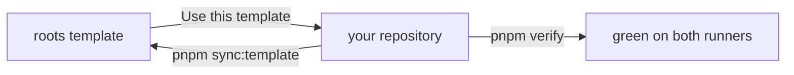

# roots

A GitHub template for pnpm + Turborepo TypeScript monorepos that AI coding
agents can work in safely from day one.

Tooling enforces the rules. One rulebook is read by Claude Code, Codex, and
Gemini CLI, guards stop the common agent mistakes before they run, and one done
gate is the same locally and in CI. Decisions, specs, and portable markdown
live in a docs system, and a sync keeps the shared mechanics current after you
have made the template your own.

## Who it is for, and not for

Solo developers and small teams starting a TypeScript monorepo where Claude
Code, Codex, or Gemini CLI do a large share of the work, on Linux, macOS, or
Windows.

Not for stacks other than TypeScript on node; the docs tooling needs node 24
and pnpm either way. Not for teams that want an external spec framework such
as Spec-Kit, or for publishing npm libraries out of the box: the built-in
decisions-and-specs flow is deliberately small, and the library recipe under
[Growth paths](./docs/template/docs-toolchain.md#growth-paths) ships unwired.
Not for anyone who wants an unopinionated starter.

## What is in the box

- One agent rulebook, [AGENTS.md](./AGENTS.md), read by Claude Code, Codex,
  and Gemini CLI. How each tool reads it, the guards, the skills, and the
  writing rules is in [agent-surfaces](./docs/template/agent-surfaces.md).
- Pre-tool guards in all three tools, threat model in
  [guards](./docs/template/guards.md), and skills under `.claude/skills/` for
  the recurring procedures.
- One done gate, `pnpm verify`: every CI check in CI order, stopping at the
  first failure, the same on Ubuntu and Windows ([Commands](#commands)).
- A docs system: decisions (why) and specs (what) with generated indexes, in
  portable markdown, built into an internal handbook and a public site that a
  shipped workflow publishes to GitHub Pages with `llms.txt`. Start at
  [docs/README.md](./docs/README.md); the mechanics are in
  [docs-toolchain](./docs/template/docs-toolchain.md).
- Template sync, `pnpm sync:template`, which pulls the shared mechanics into
  any child and reports what a file copy cannot carry; recipe and contract in
  [sync-template](./docs/template/sync-template.md).
- Supply-chain defaults and a sandbox: dependency build scripts off, a 48-hour
  release cooldown, pinned actions, secrets scanned at commit and in CI
  ([guards](./docs/template/guards.md#secrets-in-commits)), a Renovate config
  that keeps dependencies and pins current in one grouped PR a week
  ([docs-toolchain](./docs/template/docs-toolchain.md#keep-dependencies-current-with-renovate)),
  and a devcontainer for unattended runs
  ([docs-toolchain](./docs/template/docs-toolchain.md#sandbox-agents-in-a-devcontainer)).

## Layout

```text
AGENTS.md          the rulebook; CLAUDE.md is one line importing it
.claude/           guards (hooks/), rules, skills, writing rules (output-styles/), settings
.codex/ .gemini/   the same guards and writing rules registered for Codex and Gemini CLI
.agents/skills/    generated mirror of .claude/skills for Codex and Gemini
apps/ packages/    the workspace; example-app consumes example-package
docs/internal/     the handbook: decisions/ and specs/ (yours)
docs/public/       the public site (yours)
docs/template/     template-owned rules and contracts (synced; read on GitHub)
scripts/           verify, sync, the docs generators and checkers, test suites
.github/           CI on Ubuntu and Windows, docs gates, labels, templates
```



## First run

> [!IMPORTANT]
> You are reading a repository just created from the roots template. Nothing in
> the tree depends on the template's name, so there is no rename script. Work
> through this list once, then delete the section. In Claude Code the
> `first-run` skill does every step marked **(skill)** and hands you the rest.

1. **Prove the done gate.** `pnpm install && pnpm verify`, green before you
   touch anything. **(skill)**
2. **Name it.** **(skill; it asks you for the one-line pitch)**
   - `package.json`: `name` (your repo slug), `description`, and
     `repository.url`.
   - This file: the H1 and the pitch above; delete "Who it is for, and not
     for", "What is in the box", and the diagram under Layout, which describe
     the template. Keep the provenance line under "Where things live".
   - `docs/public/index.md` and `getting-started.md`: two stubs for your
     product; the shipped pages describe the template and the public site
     publishes what is here.
   - `LICENSE`: the copyright holder and year (the template ships MIT).
   - `.github/CODEOWNERS`: `@RemiMyrset` becomes your GitHub user or team, and
     the comment above it goes.
   - `.github/ISSUE_TEMPLATE/config.yml`: `RemiMyrset/roots` in both links.
   - `CODE_OF_CONDUCT.md`: the `@RemiMyrset` contact becomes yours.
   - Optional: a package scope other than `@repo/`. In any POSIX shell (Git
     Bash on Windows), `grep -rl '@repo/' --exclude-dir=node_modules .` lists
     every file.
3. **Agent tools.** Say yes to the trust prompts or the guards stay off:
   Codex asks for the folder and then for each hook (`/hooks`); Gemini asks
   to confirm the hooks; Claude Code asks for the folder. Details in
   [agent-surfaces](./docs/template/agent-surfaces.md#trust-and-registration).
   If `main` is not your only protected branch, set `PROTECTED_BRANCHES` as
   [Push protection](./docs/template/guards.md#push-protection) in guards
   says. **(skill; the branch list only)**
4. **Samples and stubs.** `packages/example-package` and `apps/example-app`
   keep the done gate honest; replace them when real code lands (the
   `new-package` skill scaffolds the house shape). The two `docs/public/`
   stubs from step 2 grow into product docs later; keep one page beside
   `docs/public/index.md` or the build emits no `llms.txt`. Not today.
5. **GitHub settings.** Needs `gh auth login`; `OWNER/REPO` is your repository.
   **(skill)**

   ```sh
   gh repo edit OWNER/REPO --description "your pitch" --add-topic typescript --add-topic pnpm --add-topic turborepo --add-topic ai-agents --enable-wiki=false --enable-projects=false --delete-branch-on-merge
   gh workflow run labels.yml   # seeds the labels from .github/labels.yml
   gh api -X PUT repos/OWNER/REPO/vulnerability-alerts                       # Renovate's security PRs need the alerts
   gh api -X PUT repos/OWNER/REPO/actions/permissions -F enabled=true -f allowed_actions=all -F sha_pinning_required=true
   ```

6. **Renovate.** Install the app on the repository at
   [github.com/apps/renovate](https://github.com/apps/renovate); `renovate.json`
   is already in place and the app opens an onboarding PR to confirm it. What
   the config does, and the self-hosted fallback, are in
   [docs-toolchain](./docs/template/docs-toolchain.md#keep-dependencies-current-with-renovate).
   **(skill prints the link)**
7. **Commit and push.** Delete this section, then
   `git commit -am "chore: initialize from roots"` and push `main` yourself.
   This is the one direct push, and it is yours: the push guard denies it to
   agents. Everything after lands through a PR. **(skill proposes the commit;
   it never pushes)**
8. **Branch ruleset.** Run the command under
   [Push protection](./docs/template/guards.md#push-protection) in guards; it
   says when the ruleset can be created and what it costs.
9. **Publish the public docs (optional).** Enable GitHub Pages with
   `gh api -X POST repos/OWNER/REPO/pages -f build_type=workflow`; the `pages`
   workflow deploys `docs/public/` on each push to `main` that touches its
   inputs from then on. Then
   `gh repo edit OWNER/REPO --homepage https://OWNER.github.io/REPO/`.
   **(skill)**

## Setup

Node 24 (pinned in `.node-version`) and pnpm. On node 24, `corepack enable`
provides pnpm; on node 25 and later install it standalone (`npm i -g pnpm`).
Either way it honours the version pinned in `package.json`.

Linux, macOS, and Windows all work, and CI runs on Ubuntu and Windows. On
Windows use Git for Windows (Claude Code runs its shell through Git Bash), and
the devcontainer needs Docker Desktop. Then:

```sh
pnpm install
```

## Commands

| Command | What it does |
| --- | --- |
| `pnpm verify` | The done gate: every check CI runs, in CI order, stopping at the first failure (`pnpm verify <gate>` resumes there, `pnpm verify --only <gate>` runs one) |
| `pnpm build` / `pnpm test` / `pnpm typecheck` | Turbo across packages that define each script; `typecheck` also runs root `tsc` over scripts + configs |
| `pnpm --filter @repo/example-package test` | One package's tests (`test:watch` for watch mode) |
| `pnpm --filter @repo/example-app start` | Runs the sample CLI (`node src/main.ts`) against the sample package |
| `pnpm lint` / `pnpm lint:fix` | ESLint (antfu flat config) repo-wide |
| `pnpm lint:secrets` | secretlint over every tracked file |
| `pnpm test:hooks` | Agent guard fixtures (allow/deny cases, node only) |
| `pnpm test:sync` | Template-sync fixtures (throwaway template + child repos, node only) |
| `pnpm test:docs` | Docs checker fixtures (a clean tree and a broken one, node only) |
| `pnpm test:gates` | Drift check: `pnpm verify` and the workflows run the same steps |
| `pnpm docs:gen` | Regenerate the decisions and specs indexes and the `.agents/skills` mirror |
| `pnpm docs:check` / `pnpm docs:portability` | Docs structure + portability gates |
| `pnpm docs:internal:build` / `pnpm docs:public:build` | Site builds (CI-blocking) |
| `pnpm docs:internal:dev` | Internal handbook (VitePress, team-only) |
| `pnpm docs:public:dev` | Public docs site |
| `pnpm sync:template` | Pull the template's mechanics: stages them, records the sync point, prints commits since and `package.json` follow-ups (`--ref` pins a template tag or branch) |
| `pnpm release` | changelogen: version, CHANGELOG, tag, push; human-run (agents are blocked) |

## Working with AI agents

- The rulebook is [AGENTS.md](./AGENTS.md). How Claude Code, Codex, and Gemini
  CLI each read it, and the trust prompts the last two show, are in
  [agent-surfaces](./docs/template/agent-surfaces.md).
- Pre-tool guards deny the common mistakes in all three tools; what they catch
  and what they do not is in [guards](./docs/template/guards.md).
- The writing rules, `.claude/output-styles/writing.md`, load at every session
  start in all three tools; [agent-surfaces](./docs/template/agent-surfaces.md#writing-rules)
  says how.
- Feature-branch pushes and PR creation run without prompts, and a protected
  branch is reachable only through a PR a human merges
  ([Push protection](./docs/template/guards.md#push-protection)). The `pr`
  skill does the whole thing the house way.
- `pnpm sync:template` pulls the shared mechanics and the `sync-template` skill
  drives it end to end; recipe and contract are in
  [sync-template](./docs/template/sync-template.md).
- `.devcontainer/` gives every tool the same node 24 + pnpm environment inside
  a container, for unattended runs and Codespaces; the egress firewall is an
  opt-in recipe in
  [docs-toolchain](./docs/template/docs-toolchain.md#sandbox-agents-in-a-devcontainer).

## Where things live

- Agent rulebook: [AGENTS.md](./AGENTS.md), conventions and the
  canonical-source map.
- Code: `apps/` for deployables, `packages/` for libraries. The samples show the
  house shape; the `new-package` skill scaffolds more.
- Docs entry point: [docs/README.md](./docs/README.md), the two sites and the
  template-owned folder.
- Internal handbook: [docs/internal/](./docs/internal/index.md), decisions,
  specs, and this project's own guides.
- Decisions (why): [docs/internal/decisions/](./docs/internal/decisions/index.md)
- Specs (what): [docs/internal/specs/](./docs/internal/specs/index.md)
- Template-owned rules and agent material (synced):
  [docs/template/](./docs/template/README.md), including the
  [vocabulary](./docs/template/README.md#vocabulary) every page uses.
- Docs system, recipes, growth paths:
  [docs-toolchain](./docs/template/docs-toolchain.md)
- The public site, once Pages is enabled: `https://OWNER.github.io/REPO/` (the
  template's own is [remimyrset.github.io/roots](https://remimyrset.github.io/roots/)).
- Template provenance: created from [roots](https://github.com/RemiMyrset/roots);
  pull updates with `pnpm sync:template`.

## License

[MIT](./LICENSE)
