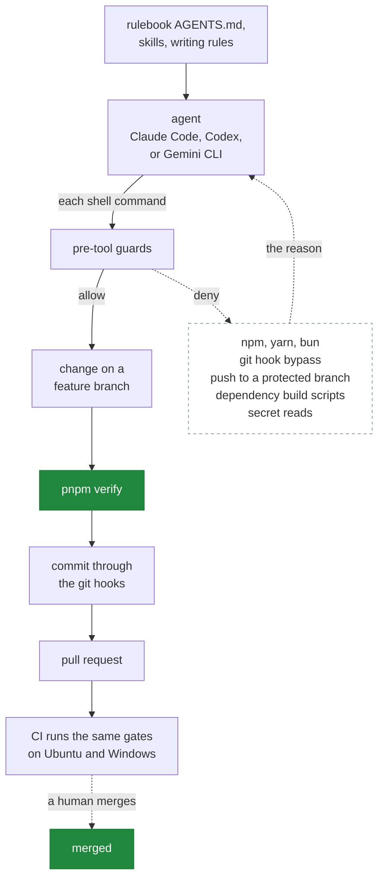
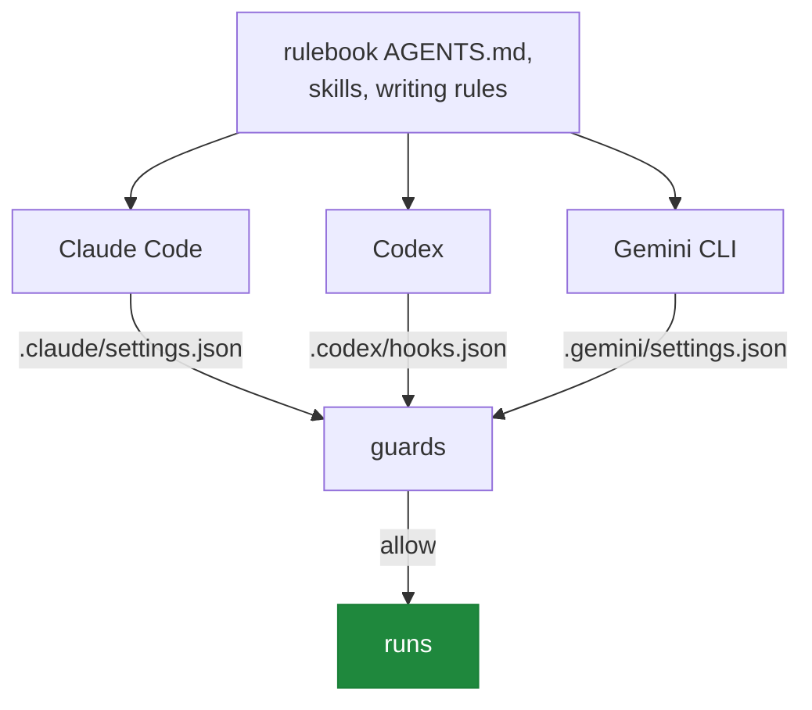
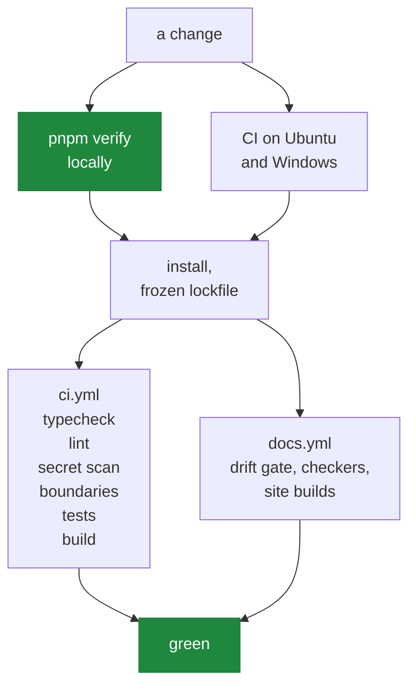
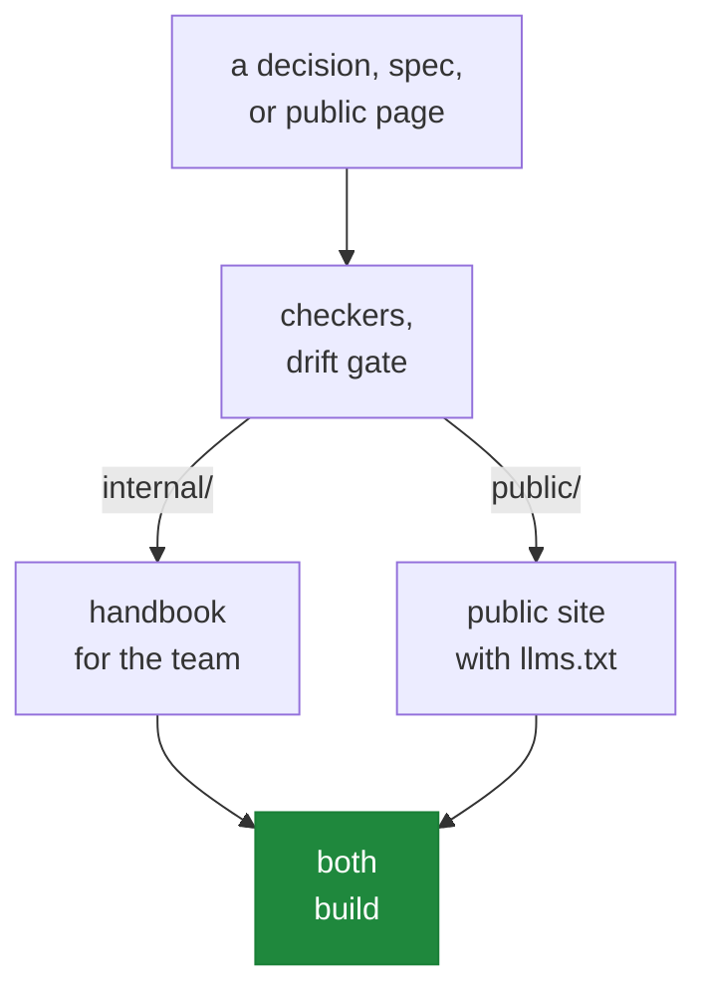
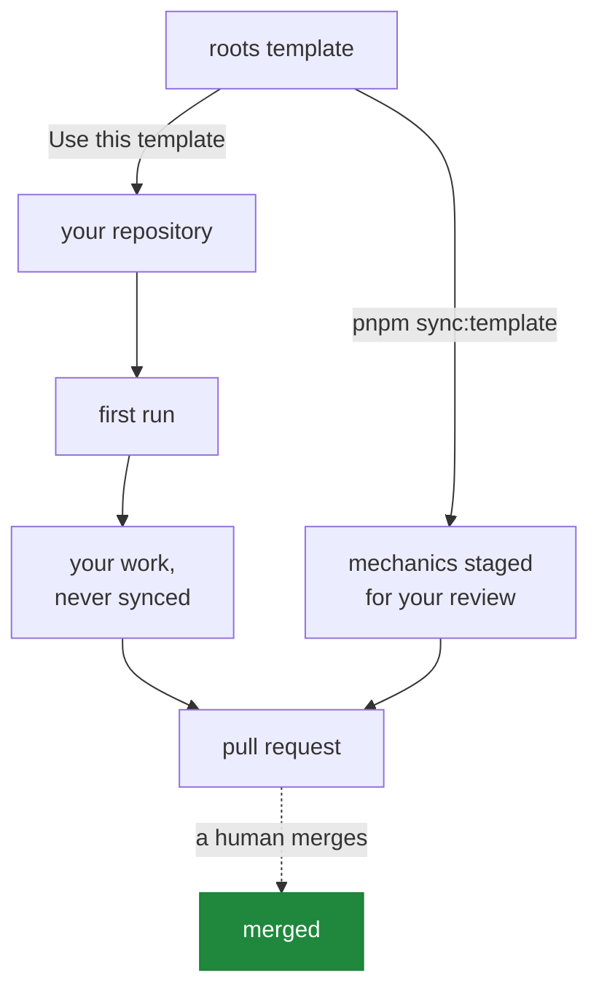

# roots

[](https://github.com/RemiMyrset/roots/actions/workflows/ci.yml)
[How it works](#how-it-works) · [Quick start](#quick-start) · [Read next](#read-next)

A GitHub template for TypeScript monorepos on pnpm and Turborepo, where AI
coding agents do much of the work. An agent can ignore its prompt, so tooling
enforces the rules: guards deny the common agent mistakes before a command runs,
one done gate runs the same checks locally and in CI, and the docs checkers and
drift gate fail a doc with a broken link or a stale generated section.

Press **Use this template**, then follow [Getting started](./docs/public/getting-started.md#first-run).

For solo developers and small teams starting a TypeScript monorepo with Claude
Code, Codex, or Gemini CLI. Not for other stacks, teams that want an external
spec framework such as Spec-Kit, publishing npm libraries out of the box, or
anyone who wants an unopinionated starter.


```mermaid
flowchart TD
  accTitle: How a change lands
  accDescr: The rulebook, skills, and writing rules steer an agent in Claude Code, Codex, or Gemini CLI; the pre-tool guards deny the listed commands before they run and tell the agent why; an allowed change on a feature branch passes pnpm verify, commits through the git hooks, opens a pull request, passes the same gates in CI on Ubuntu and Windows, and lands when a human merges it.
  R["rulebook AGENTS.md,<br>skills, writing rules"] --> A["agent<br>Claude Code, Codex,<br>or Gemini CLI"]
  A -->|"each shell command"| G["pre-tool guards"] -->|allow| B["change on a<br>feature branch"]
  G -.->|deny| X["npm, yarn, bun<br>git hook bypass<br>push to a protected branch<br>dependency build scripts<br>secret reads"]:::edge
  X -.->|"the reason"| A
  B --> V["pnpm verify"]:::ok --> C["commit through<br>the git hooks"] --> P["pull request"]
  P --> CI["CI runs the same gates<br>on Ubuntu and Windows"] -.->|"a human merges"| M["merged"]:::ok
  classDef ok fill:#1f883d,stroke:#1a7f37,color:#ffffff
  classDef edge fill:none,stroke:#8c959f,stroke-dasharray:4
```

## How it works

### Agents and guards


```mermaid
flowchart TD
  accTitle: One rulebook and one set of guards in three agent tools
  accDescr: Claude Code, Codex, and Gemini CLI read the same rulebook, skills, and writing rules, and each registers the same guards in its own settings file, so a shell command meets the same checks in every tool.
  R["rulebook AGENTS.md,<br>skills, writing rules"] --> CC["Claude Code"] & CX["Codex"] & GM["Gemini CLI"]
  CC -->|".claude/settings.json"| G["guards"]
  CX -->|".codex/hooks.json"| G
  GM -->|".gemini/settings.json"| G
  G -->|allow| RUN["runs"]:::ok
  classDef ok fill:#1f883d,stroke:#1a7f37,color:#ffffff
```

Each tool turns the guards on only after you trust the folder. Claude Code and
Gemini CLI also need the session started at the repository root, and Codex asks
you to trust each hook ([agent-surfaces](./docs/template/agent-surfaces.md#trust-and-registration)).

The guards catch a cooperative agent's common mistakes and are no security
boundary; for isolation, run the agent in an OS-level sandbox
([guards](./docs/template/guards.md#limits)). On GitHub, the branch ruleset
that first run creates guards `main` against pushes
([Push protection](./docs/template/guards.md#push-protection)).

For unattended runs, the devcontainer started with the `devcontainer` CLI
carries none of your host credentials. It still mounts your checkout writable,
and code an agent writes there runs on your host the next time git, pnpm, or
`devcontainer up` loads it, so review the run before any of them
([docs-toolchain](./docs/template/docs-toolchain.md#sandbox-agents-in-a-devcontainer)).

### Done gate and CI


```mermaid
flowchart TD
  accTitle: The done gate and CI
  accDescr: pnpm verify runs every gate on your machine one after another, in CI order, and stops at the first failure; CI runs the same gates as the steps of the ci.yml and docs.yml workflows, side by side, on Ubuntu and Windows.
  CH["a change"] --> V["pnpm verify<br>locally"]:::ok & CI["CI on Ubuntu<br>and Windows"]
  V & CI --> I["install,<br>frozen lockfile"] --> C["ci.yml<br>typecheck<br>lint<br>secret scan<br>boundaries<br>tests<br>build"] & D["docs.yml<br>drift gate, checkers,<br>site builds"] --> G["green"]:::ok
  classDef ok fill:#1f883d,stroke:#1a7f37,color:#ffffff
```

`pnpm verify` stops at the first failure and prints the command that resumes
there. A test in the done gate fails when `pnpm verify`, the workflows, and the
rulebook's [Commands](./AGENTS.md#commands) list stop naming the same gates.

pnpm installs no package version younger than 48 hours and every workflow
action is pinned to a commit SHA
([docs-toolchain](./docs/template/docs-toolchain.md#keep-dependencies-current)).
pnpm runs no dependency build script `pnpm-workspace.yaml` does not allow
([guards](./docs/template/guards.md#build-scripts)), and secretlint scans every
commit ([guards](./docs/template/guards.md#secrets-in-commits)).

### Docs system


```mermaid
flowchart TD
  accTitle: The docs system
  accDescr: Decisions, specs, and public pages are portable markdown under docs/; in the done gate the checkers and the drift gate fail a broken link, a page that breaks its format, or a stale generated section, then docs/internal builds into the handbook for the team and docs/public into the public site with llms.txt; docs/template holds the synced rules and is read on GitHub.
  W["a decision, spec,<br>or public page"] --> K["checkers,<br>drift gate"]
  K -->|"internal/"| H["handbook<br>for the team"]
  K -->|"public/"| S["public site<br>with llms.txt"]
  H & S --> B["both<br>build"]:::ok
  classDef ok fill:#1f883d,stroke:#1a7f37,color:#ffffff
```

No committed file lists the decisions or specs, so two branches that each add
one merge without a conflict ([conventions](./docs/template/conventions.md)).
A shipped workflow publishes the public site to GitHub Pages once Pages is on
([docs-toolchain](./docs/template/docs-toolchain.md#publish-the-public-site-on-github-pages)).

### Template lifecycle


```mermaid
flowchart TD
  accTitle: The template lifecycle
  accDescr: Use this template copies roots into your repository once and first run makes it yours; your own work never syncs, while pnpm sync:template stages the template's current mechanics for your review whenever you choose; both land through a pull request that a human merges.
  T["roots template"] -->|"Use this template"| C["your repository"] --> F["first run"] --> W["your work,<br>never synced"]
  T -->|"pnpm sync:template"| S["mechanics staged<br>for your review"]
  F ~~~ S
  W & S --> P["pull request"] -.->|"a human merges"| M["merged"]:::ok
  classDef ok fill:#1f883d,stroke:#1a7f37,color:#ffffff
```

`pnpm sync:template` commits nothing, prints what a file copy cannot carry as
follow-ups, and never edits `apps/`, `packages/`, `docs/internal/`, `docs/public/`,
`README.md`, `AGENTS.md`, or `package.json` ([sync-template](./docs/template/sync-template.md)).

## Quick start

Node 24 and pnpm, on Linux, macOS, or Windows ([setup](./docs/template/setup.md)).

```sh
pnpm install         # dependencies, then the git hooks
pnpm verify          # the done gate: every CI check, in CI order
pnpm sync:template   # later, in your repository: stage the template's mechanics
```

Every other command is in the rulebook's [Commands](./AGENTS.md#commands) list.

## Read next

| Topic | Page |
| --- | --- |
| The rulebook every agent reads | [AGENTS.md](./AGENTS.md) |
| Why roots is shaped this way | [conventions](./docs/template/conventions.md) |
| How each tool loads the rulebook, guards, and skills | [agent-surfaces](./docs/template/agent-surfaces.md) |
| What the guards catch and miss | [guards](./docs/template/guards.md) |
| Decisions, specs, and the two docs sites | [docs/README.md](./docs/README.md) |
| Docs tooling, recipes, growth paths | [docs-toolchain](./docs/template/docs-toolchain.md) |
| Template sync recipe and contract | [sync-template](./docs/template/sync-template.md) |
| Branches and the PR flow | [CONTRIBUTING.md](./CONTRIBUTING.md) |

## License

[MIT](./LICENSE)
