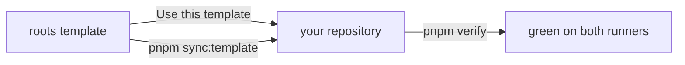

# roots

A GitHub template for pnpm + Turborepo TypeScript monorepos that AI coding
agents can work in safely from day one.

Tooling enforces the rules: one rulebook read by Claude Code, Codex, and Gemini
CLI, guards that stop the common agent mistakes before they run, and one done
gate that is the same locally and in CI. Decisions, specs, and portable
markdown live in a docs system, and a sync keeps the template-owned files
(guards, gates, docs checkers, skills) current in your repository. To start,
press **Use this template** and work through [First run](#first-run) in the
new repository.

## Who it is for, and not for

Solo developers and small teams starting a TypeScript monorepo where Claude
Code, Codex, or Gemini CLI do a large share of the work, on Linux, macOS, or
Windows.

Not for stacks other than TypeScript on node; the docs tooling needs node 24
and pnpm either way. Not for teams that want an external spec framework such
as Spec-Kit, or for publishing npm libraries out of the box: the built-in
decisions-and-specs flow is deliberately small, and the library recipe under
[Growth paths](./docs/template/docs-toolchain.md#growth-paths) ships unwired.
Not for anyone who wants an unopinionated starter.

## What is in the box

- One agent rulebook, [AGENTS.md](./AGENTS.md), read by Claude Code, Codex,
  and Gemini CLI. How each tool reads it, the guards, the skills, and the
  writing rules is in [agent-surfaces](./docs/template/agent-surfaces.md).
- Pre-tool guards in all three tools, threat model in
  [guards](./docs/template/guards.md), and skills under `.claude/skills/` for
  the recurring procedures.
- One done gate, `pnpm verify`: every CI check in CI order, stopping at the
  first failure, the same on Ubuntu and Windows ([Commands](#commands)).
- A docs system: decisions (why) and specs (what) in portable markdown, listed
  from the files so branches that each add one merge without a conflict, and
  built into an internal handbook and a public site that a shipped workflow
  publishes to GitHub Pages with `llms.txt`. Start at
  [docs/README.md](./docs/README.md); how it works is in
  [docs-toolchain](./docs/template/docs-toolchain.md).
- Template sync, `pnpm sync:template`, which pulls the template-owned files
  (the mechanics) into any repository made from the template (a child) and
  reports what a file copy cannot carry; recipe and contract in
  [sync-template](./docs/template/sync-template.md).
- Supply-chain defaults and an agent container: dependency build scripts off,
  a 48-hour release cooldown, pinned actions, secrets scanned at commit and in CI
  ([guards](./docs/template/guards.md#secrets-in-commits)), an `update-deps`
  skill that refreshes dependencies and pins in one PR when you ask, with no
  bot to install
  ([docs-toolchain](./docs/template/docs-toolchain.md#keep-dependencies-current)),
  and a devcontainer for unattended runs, started with the `devcontainer` CLI,
  which forwards none of your host credentials
  ([docs-toolchain](./docs/template/docs-toolchain.md#sandbox-agents-in-a-devcontainer)).

## Layout

```text
AGENTS.md          the rulebook; CLAUDE.md is one line importing it
.claude/           guards (hooks/), rules, skills, writing rules (output-styles/), settings
.codex/ .gemini/   the same guards and writing rules registered for Codex and Gemini CLI
.agents/skills/    generated mirror of .claude/skills for Codex and Gemini
apps/ packages/    the workspace; example-app consumes example-package
docs/internal/     the handbook: decisions/ and specs/ (yours)
docs/public/       the public site (yours)
docs/template/     template-owned rules and contracts (synced; read on GitHub)
scripts/           verify, sync, the docs generators and checkers, test suites
.github/           CI on Ubuntu and Windows, docs gates, labels, templates
```


```mermaid
flowchart LR
  T[roots template] -- Use this template --> C[your repository]
  T -- pnpm sync:template --> C
  C -- pnpm verify --> G[green on both runners]
```

## First run

> [!IMPORTANT]
> On the template itself, this section is the checklist every new repository
> receives: press **Use this template**, clone the new repository, and work
> through it there ([Getting started](./docs/public/getting-started.md)). In a
> repository created from the template, work through this list once, then
> delete the section.
>
> Nothing in the tree depends on the template's name, so there is no rename
> script. In Claude Code the `first-run` skill does every step marked
> **(skill)** and hands you the rest.

1. **Prove the done gate.** With node 24 and pnpm installed as
   [Setup](#setup) says, `pnpm install && pnpm verify`, green before you touch
   anything. **(skill)**
2. **Name it.** **(skill; it asks for the pitch, the licence and its holder,
   the owners it cannot derive, and the security and conduct contacts)**
   - `package.json`: `name` (your repo slug), `description`,
     `repository.url`, and `version` back to `0.0.0`.
   - `CHANGELOG.md`, when present: delete it. It is the template's release
     history; your first `pnpm release` writes your own.
   - This file: the H1, and your pitch in place of the two paragraphs under
     it; delete "Who it is for, and not for", "What is in the box", and the
     diagram under Layout, which describe the template. Under "Where things
     live", delete the parenthetical that names the template's own site, put
     your owner (lowercased) and repository name in place of `OWNER` and
     `REPO` in the public-site address, and keep the provenance line.
   - `docs/public/index.md` and `getting-started.md`: two stubs for your
     product; the shipped pages describe the template and the public site
     publishes what is here.
   - `LICENSE`: the template ships MIT; set the copyright holder and year.
     For another licence replace the file; for none delete it and the License
     section at the end of this file.
   - `.github/CODEOWNERS`: `@RemiMyrset` becomes your GitHub user, or in an
     organization a team (`@org/team`) or user handles, since an organization
     name alone is not a valid owner; the comment above it goes.
   - `SECURITY.md`, repositories that are not public: a contact address
     replaces the **Report a vulnerability** button, which GitHub offers on
     public repositories alone (step 5 turns it on there).
   - `.github/ISSUE_TEMPLATE/config.yml`: `RemiMyrset/roots` in both links.
   - `CODE_OF_CONDUCT.md`: the report contact under Enforcement becomes an
     email address that reaches your maintainers privately. GitHub has no
     private messages, so a handle takes reports only in public.
   - Optional: a package scope other than `@repo/`. In any POSIX shell (Git
     Bash on Windows),
     `grep -rl '@repo/' --exclude-dir=node_modules --exclude-dir=.claude --exclude-dir=.agents .`
     lists the files that name it; it skips the synced skills, which name
     `@repo/` only as the default. Edit each one except `pnpm-lock.yaml`,
     then run `pnpm install` to regenerate the lockfile, since the done gate
     installs with `--frozen-lockfile`.
3. **Agent tools.** Start Claude Code and Gemini CLI at the repository root
   and say yes to the trust prompts, or the guards stay off: each tool asks to
   trust the folder, and Codex then asks for each hook (`/hooks`). Details in
   [agent-surfaces](./docs/template/agent-surfaces.md#trust-and-registration).
   If `main` is not your only protected branch, set `PROTECTED_BRANCHES` as
   [Push protection](./docs/template/guards.md#push-protection) in guards
   says. **(skill; the branch list only)**
4. **Samples and stubs.** `packages/example-package` and `apps/example-app`
   keep the done gate honest; replace them when real code lands (the
   `new-package` skill scaffolds the house shape). The two `docs/public/`
   stubs from step 2 grow into product docs later; keep one page beside
   `docs/public/index.md` or the build emits no `llms.txt`. Not today.
5. **GitHub settings.** Needs `gh auth login`; `OWNER/REPO` is your repository.
   A fork of roots inherits the template flag, so add `--template=false` to
   `gh repo edit`. **(skill)**

   ```sh
   gh repo edit OWNER/REPO --description "your pitch" --add-topic typescript --add-topic pnpm --add-topic turborepo --add-topic ai-agents --enable-wiki=false --enable-projects=false --delete-branch-on-merge
   gh workflow run labels.yml -R OWNER/REPO   # seeds the labels from .github/labels.yml
   gh api -X PUT repos/OWNER/REPO/private-vulnerability-reporting   # public repositories: SECURITY.md's reporting button
   gh api -X PUT repos/OWNER/REPO/actions/permissions -F enabled=true -f allowed_actions=all -F sha_pinning_required=true
   ```

6. **Commit and push.** Delete this section, then
   `git commit -am "chore: initialize from roots"` and push `main` yourself.
   This and `pnpm release` are the only direct pushes, and both are yours: the
   push guard denies them to agents. Every other change lands through a PR.
   **(skill proposes the commit; it never pushes)**
7. **Branch ruleset.** Run the command under
   [Push protection](./docs/template/guards.md#push-protection) in guards; it
   says when the ruleset can be created and what it costs.
8. **Publish the public docs (optional).** After the push, run the three
   commands under
   [Publish the public site on GitHub Pages](./docs/template/docs-toolchain.md#publish-the-public-site-on-github-pages):
   enable Pages, run the first deploy
   (`gh workflow run pages.yml -R OWNER/REPO`), and set the homepage. The
   recipe also says what Pages costs on a private repository.
   **(skill prints them)**

## Setup

Node 24 (pinned in `.node-version`) and pnpm. On node 24, `corepack enable`
provides pnpm; on node 25 and later install it standalone (`npm i -g pnpm`).
Either way it honours the version pinned in `package.json`.

Linux, macOS, and Windows all work, and CI runs on Ubuntu and Windows. On
Windows use Git for Windows (Claude Code runs its shell through Git Bash), and
the devcontainer needs Docker Desktop. Then:

```sh
pnpm install
```

## Commands

| Command | What it does |
| --- | --- |
| `pnpm verify` | The done gate: every check CI runs, in CI order, stopping at the first failure (`pnpm verify <gate>` resumes there, `pnpm verify --only <gate>` runs one) |
| `pnpm build` / `pnpm test` / `pnpm typecheck` | Turbo across packages that define each script; `typecheck` also runs root `tsc` over scripts + configs |
| `pnpm --filter <package> test` | One package's tests (`test:watch` for watch mode) |
| `pnpm --filter @repo/example-app start` | Runs the sample CLI (`node src/main.ts`) against the sample package |
| `pnpm lint` / `pnpm lint:fix` | ESLint (antfu flat config) repo-wide |
| `pnpm lint:secrets` | secretlint over every tracked file |
| `pnpm boundaries` | turbo boundaries: no import leaves its package by relative path, and every imported package is declared |
| `pnpm test:hooks` | Agent guard fixtures (allow/deny cases, node only) |
| `pnpm test:sync` | Template-sync fixtures (throwaway template + child repos, node only) |
| `pnpm test:docs` | Docs checker fixtures (a clean tree and a broken one, node only) |
| `pnpm test:gates` | Drift check: `pnpm verify` and the workflows run the same steps; the workflows pin actions by SHA and never cancel a run on `main`; ESLint rejects `.js` files and imports and a bare trust exclusion; turbo hashes the node version; lint-staged lints what CI lints; package tsconfigs take in every file; the install hook skips a linked worktree; changelogen sends no commit author's email out unless `changelog.excludeAuthors` lists names, and the release script refuses a dirty tree; the devcontainer's `mounts` share no volume with another repository's container |
| `pnpm docs:gen` | Regenerate the `.agents/skills` mirror and any automd region a page keeps |
| `pnpm docs:check` / `pnpm docs:portability` | Docs structure + portability gates |
| `pnpm docs:list` | Print the decisions table and the spec list, read from the files (`decisions` or `specs` prints one) |
| `pnpm docs:internal:build` / `pnpm docs:public:build` | Site builds (CI-blocking) |
| `pnpm docs:internal:dev` | Internal handbook (VitePress, team-only) |
| `pnpm docs:public:dev` | Public docs site |
| `pnpm sync:template` | Pull the template's mechanics: stages them, records the sync point, prints commits since and the follow-ups in `package.json`, `pnpm-workspace.yaml`, `.claude/settings.json`, and new template files (`--ref` pins a template tag or branch) |
| `pnpm release` | changelogen: refuses a dirty tree, then version, CHANGELOG, tag, push; human-run (agents are blocked) |

## Working with AI agents

- The rulebook is [AGENTS.md](./AGENTS.md). How Claude Code, Codex, and Gemini
  CLI each read it, and the trust prompt each shows, are in
  [agent-surfaces](./docs/template/agent-surfaces.md).
- Pre-tool guards deny the common mistakes in all three tools; what they catch
  and what they do not is in [guards](./docs/template/guards.md).
- The writing rules, `.claude/output-styles/writing.md`, load at every session
  start in all three tools; [agent-surfaces](./docs/template/agent-surfaces.md#writing-rules)
  says how.
- In Claude Code, feature-branch pushes and PR creation run without prompts;
  Codex and Gemini ask each time. An agent reaches a protected branch only
  through a PR a human merges
  ([Push protection](./docs/template/guards.md#push-protection)). The `pr`
  skill does the whole thing the house way.
- `pnpm sync:template` pulls the shared mechanics and the `sync-template` skill
  drives it end to end; recipe and contract are in
  [sync-template](./docs/template/sync-template.md).
- `.devcontainer/` gives every tool the same node 24 + pnpm environment inside
  a container. Start an unattended run with the `devcontainer` CLI and keep
  VS Code and Codespaces for interactive work; what each carries in and the
  opt-in egress firewall are in
  [docs-toolchain](./docs/template/docs-toolchain.md#sandbox-agents-in-a-devcontainer).

## Where things live

- Agent rulebook: [AGENTS.md](./AGENTS.md), conventions and the
  canonical-source map.
- Code: `apps/` for deployables, `packages/` for libraries. The samples show the
  house shape; the `new-package` skill scaffolds more.
- Docs entry point: [docs/README.md](./docs/README.md), the two sites and the
  template-owned folder.
- Internal handbook: [docs/internal/](./docs/internal/index.md), decisions,
  specs, and this project's own guides.
- Decisions (why): [docs/internal/decisions/](./docs/internal/decisions/index.md)
- Specs (what): [docs/internal/specs/](./docs/internal/specs/index.md)
- Template-owned rules and agent material (synced):
  [docs/template/](./docs/template/README.md), including the
  [vocabulary](./docs/template/README.md#vocabulary) every page uses.
- Docs system, recipes, growth paths:
  [docs-toolchain](./docs/template/docs-toolchain.md)
- The public site, once Pages is enabled: `https://OWNER.github.io/REPO/` (the
  template's own is [remimyrset.github.io/roots](https://remimyrset.github.io/roots/)).
- Template provenance: [roots](https://github.com/RemiMyrset/roots);
  `pnpm sync:template` pulls its updates.

## License

[MIT](./LICENSE)
